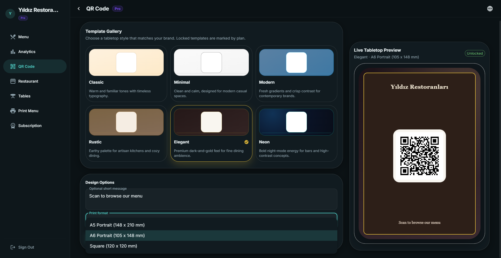
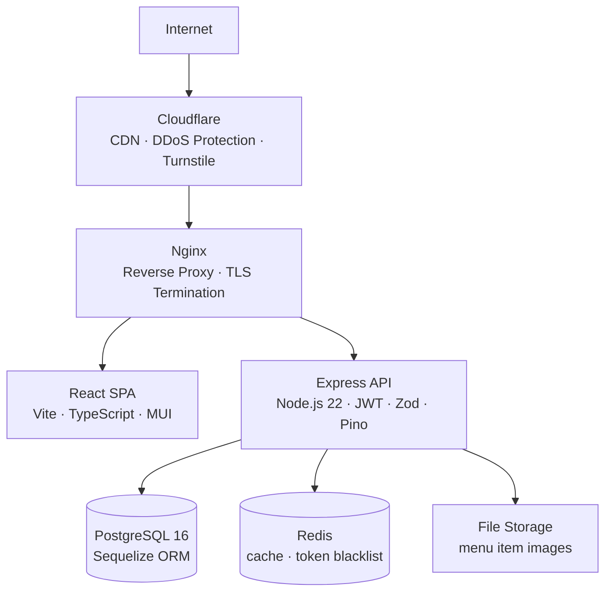

# TRQR

### Restaurant Management System with Digital QR Menus

**Menu management, table tracking, payments, and analytics — all in one dashboard.**

---

[Live Demo](#demo) · [Features](#features) · [Tech Stack](#tech-stack) · [Architecture](#architecture) · [Plans](#subscription-plans) · [Screenshots](#screenshots)

---

## Overview

TRQR is a full-stack SaaS platform for restaurant management. At its core is a QR-based digital menu system — guests scan the table QR code, browse the menu instantly on their phone, and place orders with no app download required.

But TRQR goes well beyond menus. Restaurant owners get a complete operational dashboard: manage tables and live orders, track payments with split-bill support, monitor revenue and traffic analytics, design and print branded QR tabletop cards, and configure the entire system in Turkish or English — all in real time from a single interface.

Built with a strong emphasis on production security, plan-based access control, and a clean, fast user experience.

---

## Features

### For Restaurant Owners

| Feature | Description |
|---------|-------------|
| **Menu Builder** | Drag-and-drop category and item editor. Add names, prices, descriptions, and photos. Toggle item availability instantly. |
| **QR Code Generator** | Unique QR code per restaurant. Download or print directly. |
| **6 Menu Templates** | Choose from Classic, Minimal, Modern, Rustic, Elegant, or Neon — each with a matching QR tabletop card design. |
| **Print Export** | Export printable QR tabletop cards as PDF in A5, A6, or Square format. |
| **Table Management** | Configure table count, track per-table orders, merge tables, and close bills in one tap. |
| **Payment Tracking** | Record full payments, equal splits, or per-item payments. |
| **Analytics Dashboard** | Daily views, revenue trends, top-selling items, hourly traffic distribution — all with date range filtering. |
| **Onboarding Wizard** | Step-by-step setup flow for new restaurants. |
| **Bilingual UI** | Full Turkish and English support throughout the entire dashboard. |

### For Guests

- Instant menu access by scanning the table QR code — no app install
- Clean, responsive menu display on any device
- Category-based navigation with item photos, prices, and descriptions
- Template-matched visual design consistent with the restaurant's brand

### For Platform Admins

- Full restaurant and user management
- Per-restaurant plan overrides and feature flag control
- Immutable audit log with actor, IP, HTTP context, and before/after diff
- Platform-wide analytics overview

---

## Screenshots

### Dashboard

| Menu Builder | Analytics | Table Management |
|---|---|---|
|  |  |  |

### Public Menu (Guest View)

| Classic Template | Neon Template | Elegant Template |
|---|---|---|
|  |  |  |

### QR Designer & Print Export

| QR Tabletop Designer | Print Export |
|---|---|
|  |  |

### Mobile

| Mobile Menu | Mobile Dashboard |
|---|---|
|  |  |

---

## Tech Stack

### Frontend

| Layer | Technology |
|-------|-----------|
| Framework | React 19 + TypeScript 5.8 |
| Build Tool | Vite 6 |
| UI Components | Material UI (MUI) 7 |
| Styling | Emotion (CSS-in-JS) |
| Routing | React Router 7 |
| Animations | Framer Motion 12 |
| Drag & Drop | dnd-kit |
| i18n | i18next + react-i18next |
| PDF Export | jsPDF + html2canvas |
| SEO | React Helmet Async |
| CAPTCHA | Cloudflare Turnstile |
| HTTP Client | Axios |
| Testing | Vitest + Testing Library |

### Backend

| Layer | Technology |
|-------|-----------|
| Runtime | Node.js 22 |
| Framework | Express 5 |
| Database | PostgreSQL 16 |
| ORM | Sequelize 6 |
| Caching / Token Blacklist | Redis (ioredis) |
| Authentication | JWT + HTTP-only refresh tokens |
| Validation | Zod 4 |
| File Uploads | Multer 2 |
| Logging | Pino (structured JSON logs) |
| Scheduled Jobs | node-cron |
| Password Hashing | bcryptjs |
| Testing | Jest 30 + Supertest |

### Infrastructure

| Layer | Technology |
|-------|-----------|
| Containerization | Docker + Docker Compose |
| Reverse Proxy | Nginx |
| CDN / DDoS Protection | Cloudflare |
| Deployment | VPS with Nginx + SSL |
| Environment Config | `.env` file per environment |

---

## Architecture

See [`docs/architecture.md`](docs/architecture.md) for detailed component descriptions.

---

## Menu Templates

TRQR includes six professionally designed menu templates. Each template has a matching QR tabletop card design for print export.

| Template | Tier | Style |
|----------|------|-------|
| **Classic** | Free | Warm serif typography, cream/tan tones |
| **Minimal** | Free | Clean sans-serif, monochromatic |
| **Modern** | Starter | Bold gradient, vibrant accent color |
| **Rustic** | Starter | Earthy tones, dashed borders, handcrafted feel |
| **Elegant** | Pro | Dark luxury design, gold accents |
| **Neon** | Pro | Dark cyberpunk aesthetic, cyan/neon glow |

---

## Subscription Plans

| | **Free** | **Starter** | **Pro** | **Enterprise** |
|---|---|---|---|---|
| **Price** | ₺0 | ~~₺1,999~~ ₺999 / mo | ~~₺2,999~~ ₺1,499 / mo | Custom |
| Tables | 5 | 15 | 40 | 100 |
| Categories | 5 | 15 | 30 | 50 |
| Items per Category | 15 | 30 | 50 | 100 |
| Items with Photos | 12 | 60 | 200 | 1,000 |
| Templates | Classic, Minimal | + Modern, Rustic | + Elegant, Neon | All |
| Analytics | Basic | Standard | Advanced | Premium |
| Payment Tracking | — | ✓ | ✓ | ✓ |
| Data Export | — | — | ✓ | ✓ |
| Remove Branding | — | — | ✓ | ✓ |
| Priority Support | — | — | ✓ | ✓ |

Plan limits are enforced **server-side** — no client-side bypassing.

---

## Security Highlights

TRQR is built with a production security mindset throughout.

- **Progressive CAPTCHA** — Cloudflare Turnstile is triggered after repeated failed login attempts; hard block after threshold
- **JWT + Refresh Token** — Short-lived access tokens; HTTP-only cookie refresh tokens; Redis-backed revocation on logout
- **Zod Validation** — All incoming API data validated against strict schemas before reaching business logic
- **XSS Sanitization** — Recursive sanitization on every request body, query, and params
- **Helmet** — Full HTTP security header set: CSP, HSTS, X-Frame-Options, nosniff, referrer policy
- **Rate Limiting** — Tiered limiters per endpoint category (auth, uploads, global)
- **HPP Protection** — HTTP Parameter Pollution prevention
- **Request Correlation** — Every request gets a UUID at ingress; propagated to audit logs
- **Immutable Audit Log** — Every meaningful server action is logged with actor, IP, HTTP context, resource, and before/after diff
- **Plan Enforcement** — Server-side middleware validates feature access and resource limits on every mutation

---

## Internationalization

Full bilingual support in **Turkish** and **English** — including dashboard, error messages, email flows, and the public menu page.

Language is configurable per restaurant and switchable in the dashboard at any time.

---

## Demo

🌐 **Live Product:** [https://trqr.net](https://trqr.net)

> _A live demo account may be available — see the landing page for details._

---

## Source Code

**This repository is a public showcase only. The application source code is private.**

TRQR is a commercial product. The source code — including the frontend, backend, database migrations, infrastructure configuration, and all business logic — is maintained in a private repository and is not available for public access or contribution.

This showcase exists to document the product's architecture, features, and technical decisions for portfolio and reference purposes.

For licensing inquiries, collaboration, or white-label arrangements, please reach out via the contact section below.

---

## About

Built and maintained by **Salih Yıldız**.

- **Portfolio:** [yildizsalih.com](https://yildizsalih.com)
- **GitHub:** [@salildz](https://github.com/salildz)

---

*TRQR — Bringing restaurant menus into the digital era.*

